# Module 17 Challenge - Credit Risk Analysis

## Overview of the Analysis

The objective of this analysis is to apply machine learning techniques to assess credit card risk. To achieve this we shall be using the credit card credit dataset from LendingClub, a peer-to-peer lending services company, and applying various techniques including oversampling, undersampling and combinatorial approaches on the data at hand using Logistic Regression model. We then compare machine learning models (BalancedRandomForest and AdaBoost Classifer) to predict credit risk.

## Results

The following sections illustrate the performance of the six models used in this exercise:

- Model 1 Random Oversampling

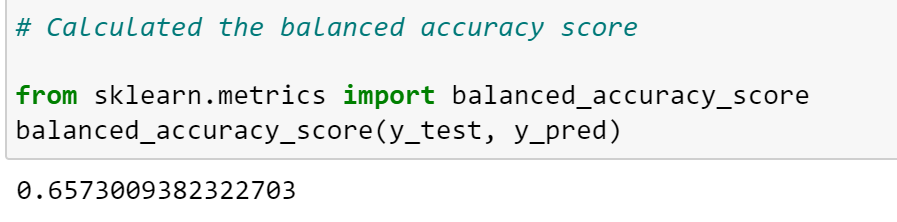

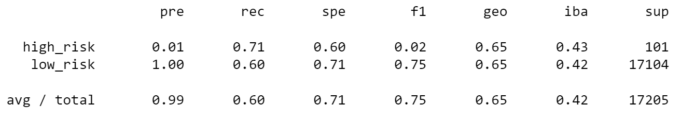

The figures above shows that the balanced accuracy score of this model is 0.6573. The high risk credit precision is 0.01 and recall is 0.71. For low credit risk, the precision is 1.00 and recall is 0.60. 

- Model 2 SMOTE Oversampling

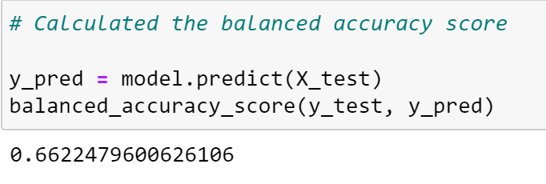

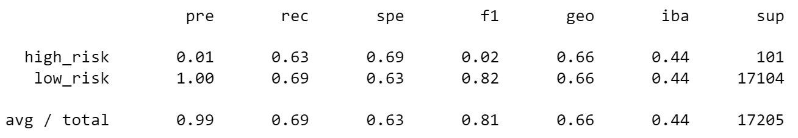

The figures above shows that the balanced accuracy score of this model is 0.6622. The high risk credit precision is 0.01 and recall is 0.63. For low credit risk, the precision is 1.00 and recall is 0.69.

- Model 3 Cluster Centroids Undersampling

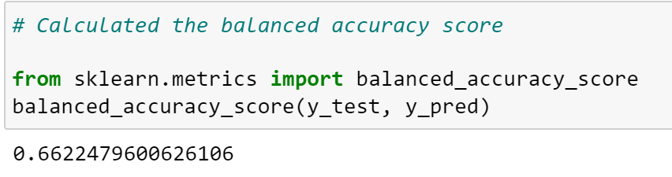

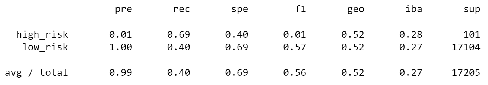

The figures above shows that the balanced accuracy score of this model is 0.6622. The high risk credit precision is 0.01 and recall is 0.69. For low credit risk, the precision is 1.00 and recall is 0.40.

- Model 4 SMOTEENN Combinatorial method

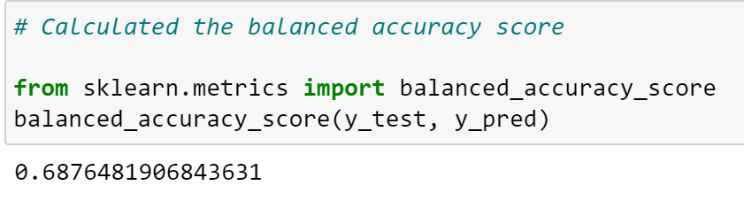

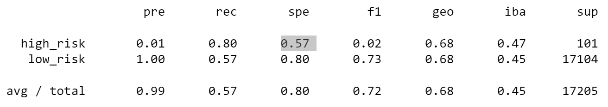

The figures above shows that the balanced accuracy score of this model is 0.6876. The high risk credit precision is 0.01 and recall is 0.80. For low credit risk, the precision is 1.00 and recall is 0.57.

- Model 5 BalancedRandomForestClassifier

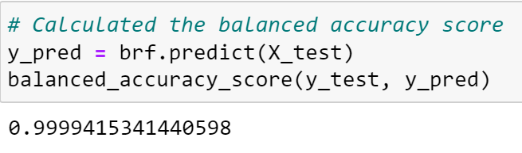

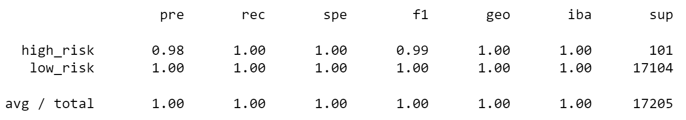

The figures above shows that the balanced accuracy score of this model is 0.9999. The high risk credit precision is 0.98 and recall is 1.00. For low credit risk, the precision is 1.00 and recall is 1.00.

- Model 6 AdaBoostClassifier
 
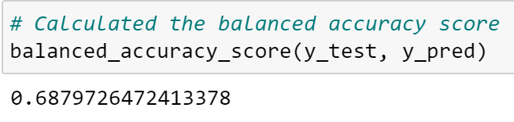

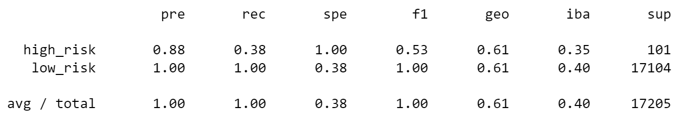

The figures above shows that the balanced accuracy score of this model is 0.6879. The high risk credit precision is 0.88 and recall is 0.38. For low credit risk, the precision is 1.00 and recall is 1.00.

## Summary and Recommendation

For the first four models which utilized various sampling techniques, we can see that SMOTEENN model (Model 4 above) performs the best. It has the highest accuracy among the four models at 0.6876. Furthermore, although the precision is low for high credit risk (similar to other models); it does have a high sensitivity score of 0.80; implying that for a known high credit risk account it has a 80% chance of identifying it correctly. Secondly the precision for low risk is 1.00.

Among the two machine learning models, BalancedRandomForestClassifier does better than AdaBoostClassifier. It has an accuracy score of 0.9999 and has extremely high values for both precision and recall, as reflected in the F1 scores of 0.99 and 1.00 for high risk and low risk respectively; showing that there is a good tradeoff between precision and recall. 

The recommended model is clearly the BalancedRandomForestClassifier, as it has the highest accuracy score as well as highest F1.